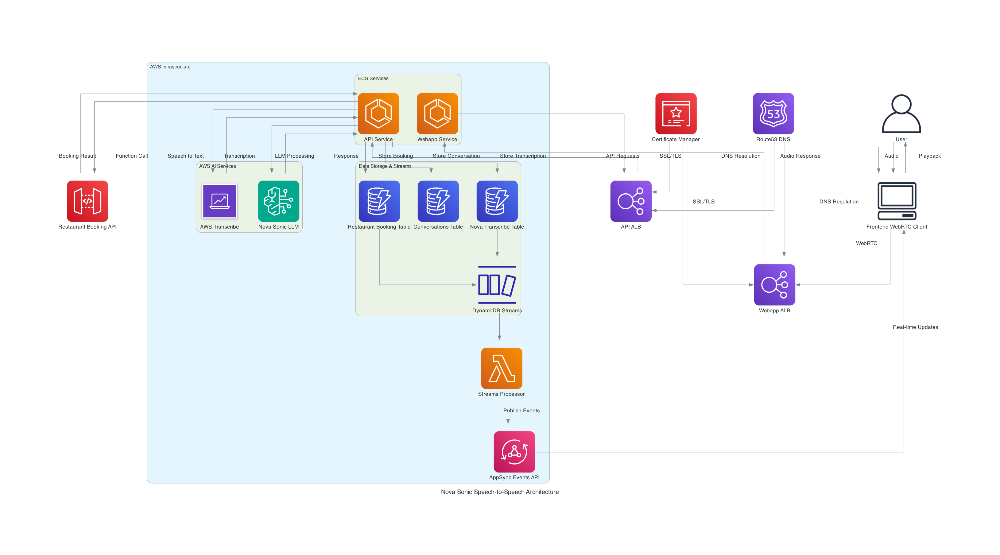
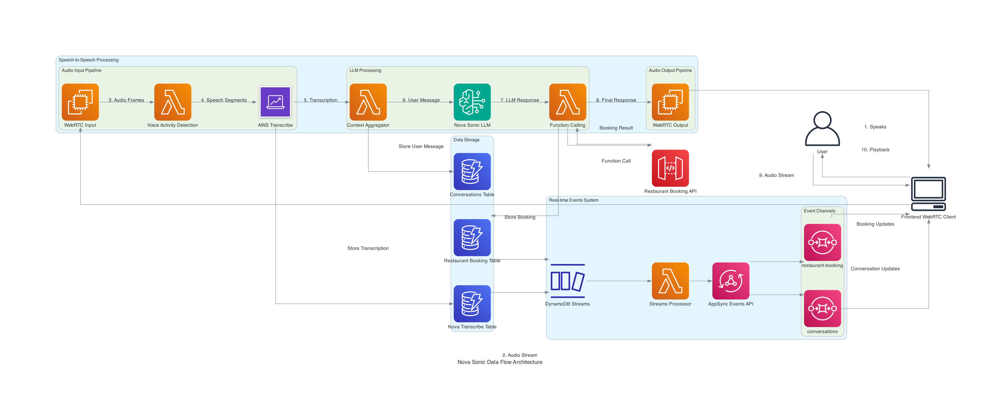
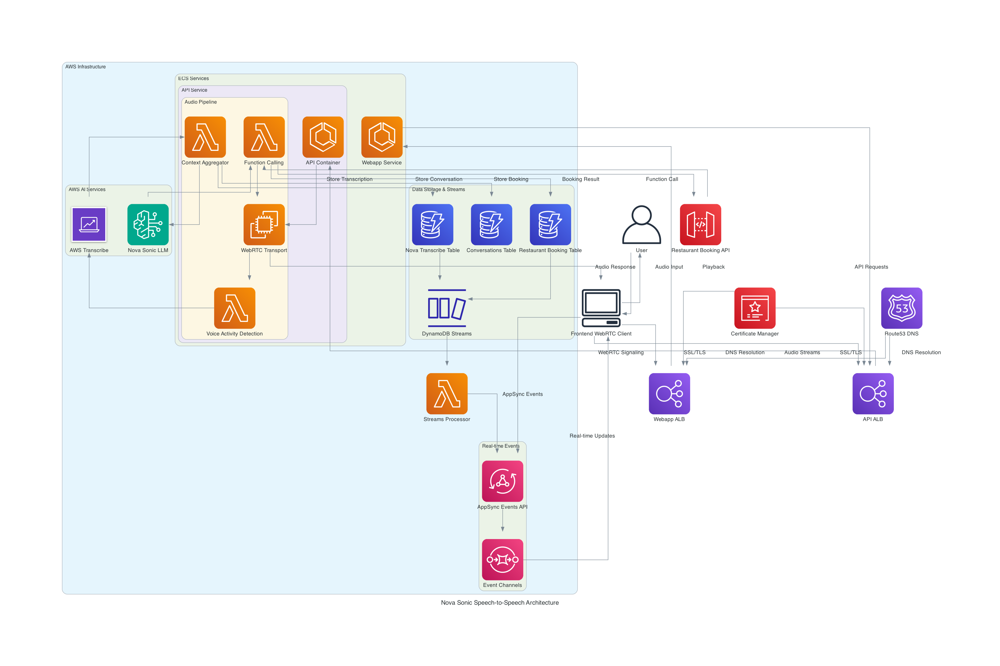

# Nova Sonic Architecture

This document provides a comprehensive overview of the Nova Sonic speech-to-speech application architecture.

## System Overview

Nova Sonic is a speech-to-speech conversation application that enables real-time voice interactions with an AI assistant powered by Amazon Bedrock. The application features WebRTC for low-latency audio streaming, a restaurant booking capability, and a real-time event system using AppSync Events API. As illustrated in Figure 1 below, the system consists of frontend and backend components working together with various AWS services.


*Figure 1: High-level architecture of the Nova Sonic application showing the main components and their interactions.*

## Key Components

The following components are illustrated in the high-level architecture diagram (Figure 1) and interact as shown in the data flow diagram (Figure 2):

### Frontend Web Application

- **Technology**: React-based web application
- **Deployment**: ECS Fargate service with Application Load Balancer
- **Features**:
  - WebRTC integration for audio streaming
  - Real-time conversation display
  - Restaurant booking interface
  - AppSync Events API client for real-time updates

### Backend API Service

- **Technology**: Python-based API service
- **Deployment Options**:
  - ECS Fargate service (default)
  - EC2 instances running Docker containers (alternative)
- **Features**:
  - Audio processing and streaming
  - Integration with Amazon Bedrock
  - DynamoDB interaction for data persistence
  - Restaurant booking API integration
  - AppSync Events API integration for real-time events

### AWS Services

#### Amazon Bedrock

- Powers the AI conversation capabilities
- Provides Nova Sonic for speech synthesis
- Enables natural language understanding and generation

#### Amazon DynamoDB

- **Tables**:
  - `NovaSonicConversations`: Stores conversation history
  - `RestaurantBookings`: Stores restaurant booking information
- **Features**:
  - DynamoDB Streams for change data capture
  - On-demand capacity for cost optimization

#### AWS AppSync Events API

- Provides real-time publish/subscribe functionality
- Enables real-time updates for conversation and booking events
- Integrates with DynamoDB Streams via Lambda function

#### AWS Elastic Container Service (ECS)

- Manages container deployment and orchestration
- Supports both Fargate and EC2 launch types
- Auto-scaling based on CPU utilization

#### AWS Elastic Load Balancing

- **Application Load Balancer (ALB)**:
  - Distributes HTTP/HTTPS traffic
  - Supports WebSocket connections
  - Enables HTTPS with AWS Certificate Manager
- **Network Load Balancer (NLB)**:
  - Handles WebRTC UDP traffic
  - Enables low-latency audio streaming

#### Amazon Route 53

- DNS management for custom domains
- Integration with AWS Certificate Manager for HTTPS

## Network Architecture

The network architecture, as depicted in Figure 3, includes the following components:

### VPC Configuration

- VPC with public and private subnets across 2 availability zones
- NAT Gateway for outbound internet access from private subnets
- Security groups for fine-grained access control

### Security Groups

- **API Security Group**: Controls access to the API service
- **API Load Balancer Security Group**: Controls access to the API load balancer
- **WebRTC Load Balancer Security Group**: Controls access to the WebRTC load balancer
- **Webapp Security Group**: Controls access to the web application

## Data Flow

The following diagram (Figure 2) illustrates how data flows through the Nova Sonic system during user interactions:


*Figure 2: Data flow diagram illustrating how information moves through the Nova Sonic system during user interactions.*

### Speech-to-Speech Conversation Flow

1. User speaks into the microphone on the web application
2. Audio is streamed via WebRTC to the backend API
3. API sends the audio to Amazon Transcribe for speech-to-text conversion
4. Transcribed text is sent to Amazon Bedrock for processing
5. Bedrock generates a response
6. Response is sent to Amazon Nova Sonic for text-to-speech conversion
7. Synthesized speech is streamed back to the user via WebRTC
8. Conversation history is stored in DynamoDB
9. DynamoDB Streams trigger Lambda function
10. Lambda function publishes events to AppSync Events API
11. Web application receives real-time updates via AppSync subscription

### Restaurant Booking Flow

1. User requests to book a restaurant through voice conversation
2. Bedrock identifies the booking intent and extracts details
3. API sends booking request to the Restaurant Booking API
4. Booking confirmation is stored in DynamoDB
5. DynamoDB Streams trigger Lambda function
6. Lambda function publishes booking event to AppSync Events API
7. Web application receives real-time booking confirmation via AppSync subscription

## Real-time Event System

The AppSync Events API provides real-time publish/subscribe functionality for change data capture from DynamoDB tables. This enables real-time updates for conversation and booking events, as illustrated in the data flow diagram (Figure 2).

### Components

- **AppSync Events API**: AWS AppSync API configured as an EVENTS API
- **DynamoDB Tables with Streams**: Tables with DynamoDB streams enabled
- **Lambda Function**: Processes DynamoDB stream events and publishes to AppSync
- **Client Integration**: Web clients subscribe to AppSync for real-time updates

### Channels

- **restaurant-booking**: Events related to restaurant bookings
- **conversations**: Events related to conversation transcripts

## Deployment Options

Nova Sonic supports multiple deployment options as shown in Figure 3. The detailed architecture diagram below illustrates the infrastructure components and how they interact in different deployment scenarios:


*Figure 3: Detailed architecture diagram showing the deployment options and infrastructure components of the Nova Sonic system.*

### ECS-based Deployment (Default)

```
┌───────────────┐     ┌───────────────┐     ┌───────────────┐
│   Application │     │      ECS      │     │  EC2 Instance │
│ Load Balancer │────▶│    Service    │────▶│  or Fargate   │
└───────────────┘     └───────────────┘     └───────────────┘
                                                    │
                                                    ▼
                                           ┌───────────────┐
                                           │   DynamoDB    │
                                           └───────────────┘
```

- Managed container orchestration
- Better integration with AWS ecosystem
- More sophisticated deployment options
- Built-in monitoring and logging

### EC2-based Deployment (Alternative)

```
┌───────────────┐     ┌───────────────┐     ┌───────────────┐
│   Application │     │      Auto     │     │  EC2 Instance │
│ Load Balancer │────▶│ Scaling Group │────▶│ with Docker   │
└───────────────┘     └───────────────┘     └───────────────┘
                                                    │
                                                    ▼
                                           ┌───────────────┐
                                           │   DynamoDB    │
                                           └───────────────┘
```

- Simpler architecture with fewer AWS services
- Direct control over the Docker runtime
- Potentially lower costs for certain workloads
- Easier to debug and troubleshoot

## Security Considerations

As shown in the architecture diagrams (Figures 1 and 3), security is implemented at multiple layers of the Nova Sonic system:

- Security groups restrict traffic between components
- IAM roles follow the principle of least privilege
- Containers run in private subnets with outbound internet access through NAT Gateway
- Load balancers are the only components exposed to the internet
- HTTPS is configured for secure communication and to enable WebRTC functionality
- HTTP to HTTPS redirection is implemented for enhanced security

## Cost Optimization

As shown in the deployment architecture (Figure 3), several cost optimization strategies are implemented:

- Auto-scaling is configured to scale based on CPU utilization
- NAT Gateway is shared across availability zones to reduce costs
- DynamoDB is configured with on-demand capacity to optimize costs based on usage
- EC2-based deployment option for potentially lower costs in certain scenarios